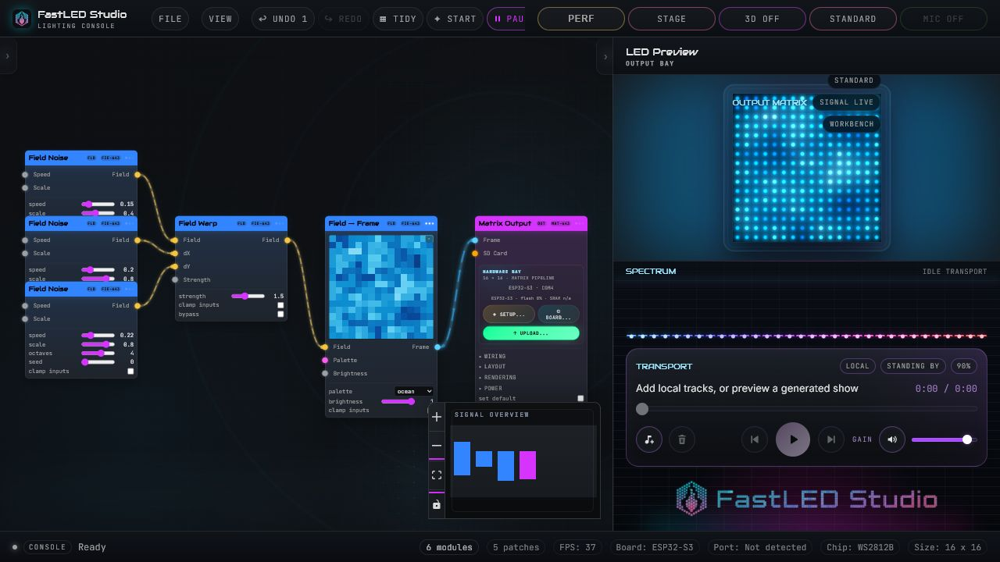
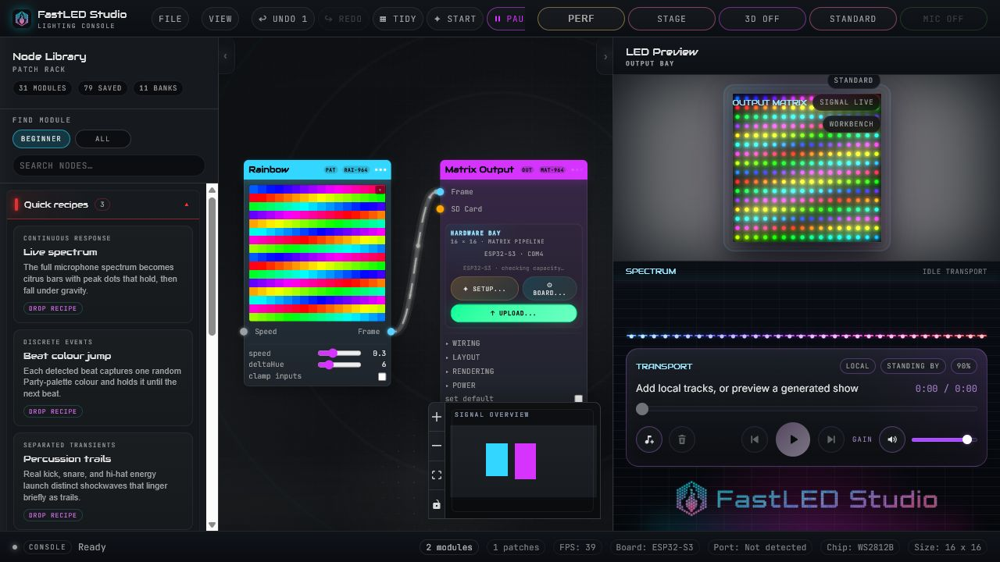
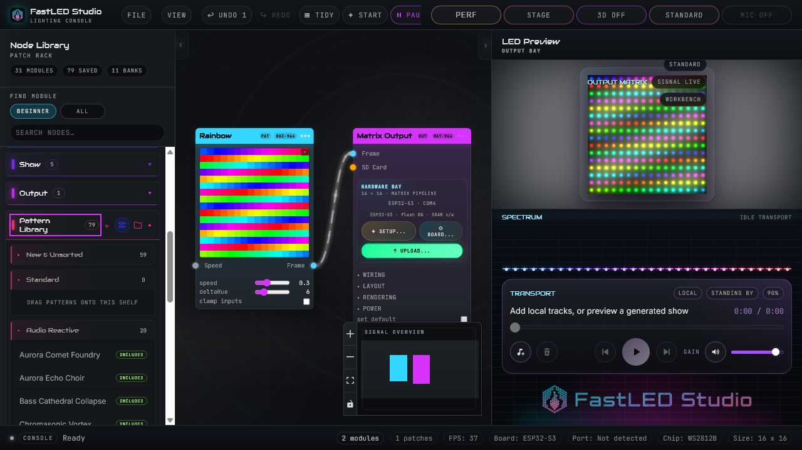

# FastLED Studio

Design LED animations as a live node graph, watch them move on a virtual matrix, then send the same patch to FastLED hardware.

**Public beta · 144 nodes · 20 included audio-reactive patterns · Windows/macOS/Linux packaging · MIT core**



FastLED Studio is a visual authoring environment for LED strips, matrices, and tiled panels. Drag in generators, signals, palettes, effects, audio analysis, and hardware output; connect matching ports; and tune every control while the main preview and node previews run live.

> **Beta hardware testers wanted.** If you have an ESP32-family board, an Arduino, a Pico, an unusual LED chipset, tiled panels, or an audio setup, see [Help test the beta](#help-test-the-beta). Reports from real wiring are the fastest way to turn experimental combinations into supported ones.

## See it in action

| Build and preview a patch | Browse reusable patterns |
|---|---|
|  |  |

## Your first five minutes

1. **Start with something alive.** On the empty canvas choose **Start with Rainbow**, **Audio-reactive demo**, or **Browse starter patches**. The **✦ Start** button reopens the gallery at any time.
2. **Read the graph left to right.** Source nodes create values or pixels; effects transform them; **Matrix Output** is the destination. Ports with the same color/type connect.
3. **Try one edit.** Change a speed, palette, particle style, or effect amount. The LED preview updates immediately.
4. **Add a module.** Click a card in the left Node Library or drag it onto the canvas. Drag a cable onto empty canvas to see only compatible next nodes.
5. **Open Help.** Press **?** for the Quick Start, shortcuts, upload guide, illustrated examples, and searchable reference for every node.

The fastest experiments are in **Quick recipes** in the sidebar: *Live spectrum*, *Beat colour jump*, and *Percussion trails* each place a complete working chain on the canvas.

## Two main workflows

### 1. Make a reusable pattern show

```text
Pattern patch → Group → Save to Library → Pattern Library
              → Pattern Collection → Show Engine → Matrix Output → Hardware
```

1. Build a patch that ends in a frame. Select the pattern-producing nodes—not the scene's **Mic Input** or **Matrix Output**—and press **Ctrl/Cmd + G** or choose **Make Group**.
2. Name the Group and enable **Save to library**, or right-click the completed Group and choose **Save to Library**.
3. The pattern appears under **Pattern Library → New & Unsorted**. Drag it onto **Standard**, **Audio Reactive**, or a shelf you created with **＋**. Removing a custom shelf safely returns its patterns to New & Unsorted.
4. Add a **Pattern Collection**. Drag Pattern Library cards directly onto it, or wire a Group's frame output to its `pattern` input. The collection absorbs each Group as a reusable show entry.
5. Wire `Pattern Collection.patternset` → `Show Engine.patternset`, then `Show Engine.frame` → `Matrix Output.frame`. A **Transitions** node and beat input are optional.
6. Configure the board and port in Matrix Output, run **Flash Wiring Test**, then choose **Upload**.

The beta includes 20 curated patterns in the built-in **Audio Reactive** shelf. They expose an audio input: add a **Microphone** node and connect it when auditioning one on the canvas. Included patterns are immutable examples; your own copies and saved patterns remain yours to rename, organize, share, or delete.

### 2. Send one patch straight to hardware

```text
Pattern → optional signals/palettes/effects → Matrix Output → Hardware
```

1. Wire any frame-producing pattern directly—or through effects—into **Matrix Output**.
2. Open **⚙ Board**, select the controller and USB port, then confirm width, height, chipset, color order, data pin, layout, brightness, and optional power limit.
3. Use **🧪 Flash Wiring Test** first on new wiring. It checks colors, orientation, tiles, and physical pixel order without needing a finished patch.
4. Choose an output route:
   - **Upload** compiles and flashes a standalone FastLED sketch.
   - **⚡ Flash Stream Receiver** once, then **📡 Live Stream** for rapid no-recompile preview.
   - **View Code** or **Export .ino** if you want to inspect or build the sketch yourself.
   - **Upload show to SD** provisions the separate music-synced SD-card workflow.

## Pattern Library

The old **My Patterns** rack is now the **Pattern Library**:

- **New & Unsorted** receives every newly saved or imported pattern.
- **Standard** and **Audio Reactive** are permanent built-in shelves.
- Create custom shelves with **＋** and remove them without deleting their patterns.
- Drag your patterns onto a shelf header to file them, or back to **New & Unsorted** to unfile them.
- Click a pattern to place it near the center of the canvas, drag it to position it, or drag it directly onto a Pattern Collection.
- The optional local helper mirrors user patterns as shareable JSON files in its per-user `My Patterns` data folder. Included beta patterns are bundled with the application and are not written over your files.


## Install and run

### Portable desktop beta

When a release archive is available for your operating system, extract it and launch **FastLED Studio** (`FastLED Studio.exe` on Windows). The portable package includes the Studio, upload helper, fbuild, and esptool; users do not need to install Node.js or Python.

The browser opens automatically. Keep the launcher window open while using hardware, project-file, and Pattern Library disk features. Packaging details are in [Desktop distribution](docs/release/desktop-distribution.md).

### Run from source

1. Install [Node.js](https://nodejs.org) LTS. Install [Python 3](https://python.org) as well if you want local upload features.
2. Clone or download this repository.
3. Launch it:
   - **Windows:** double-click `Start FastLED Studio.bat`
   - **macOS:** double-click `Start FastLED Studio.command`; on first use, right-click it and choose **Open**
   - **Linux:** run `./start.sh`

For development:

```bash
npm install
npm run dev        # http://localhost:5173
```

The first source launch installs dependencies and can take a few minutes. Without Python, visual authoring, projects, code export, and preview still work; direct hardware actions stay unavailable.

## Security messages you may see

FastLED Studio is in beta and the direct-download desktop packages are not yet code-signed or notarized.

- **Windows SmartScreen:** Windows may show **Windows protected your PC** or **Unknown publisher**. Only continue with **More info → Run anyway** when the archive came from this repository's official release page and you expected to run it. Do not disable SmartScreen system-wide.
- **macOS Gatekeeper:** macOS may say the application cannot be opened because the developer cannot be verified. For an official beta archive, right-click the application and choose **Open** to make the one-time exception. Do not remove Gatekeeper globally.
- **Imported projects and patterns:** files and share links are treated as untrusted. Formula and Code previews remain blocked until you review the source and choose **Trust and run**. Only trust content from people you know.
- **Microphone permission:** audio-reactive previews require browser microphone permission. Audio stays in the browser analysis pipeline; a denied permission simply leaves live audio nodes inactive.
- **Local helper and USB access:** upload, serial streaming, file dialogs, and disk-backed pattern/project sync use a service on your own machine. It listens on localhost and needs access to the selected serial device. Your firewall or operating system may ask for confirmation on first launch.

Read the full [Security policy](SECURITY.md) and report vulnerabilities privately through the channel documented there.

## Help, examples, and node reference

Press **?** inside Studio. Help contains:

- a beginner Quick Start and canvas/wiring gestures;
- keyboard shortcuts;
- upload, wiring-test, live-stream, code-export, and SD-show instructions;
- searchable documentation for every node, including ports, controls, use cases, and live example diagrams.

The empty-canvas launcher and **✦ Start** gallery include Rainbow Sweep, Fire, Scrolling Text, Audio Spectrum, Field Warp, a generative show, and a music-synced SD show. The Pattern Library adds 20 richer audio-reactive examples for dismantling, remixing, and collecting.

## Complete node catalogue

FastLED Studio currently ships **144 nodes**. The in-app **Help → Node Reference** is authoritative and explains each one in depth.

<details>
<summary><strong>Show all nodes by category</strong></summary>

- **Inputs:** Microphone, Button, Potentiometer, Encoder, MIDI
- **Audio:** FFT Analyzer, Beat Detect, Percussion Detect, Audio Features, Audio → Hue
- **Signals:** Time, Interval, Counter, Random, Envelope, Sin, Cos, Wave, Complex Wave, BeatSin, Clock
- **Math & Logic:** Math, Clamp, Map Range, Lerp, Ease, Abs, Mod, Gate, Smooth, Sample & Hold, Switch, Not, Compare, Trigger, XY → Index
- **Color:** Hue Cycle, HSV → RGB, RGB → HSV, Color Temperature, Heat Color, Blend Colors, CHSV, Gradient Sampler, Palette Sampler, Palette Sweep, Palette Selector, Custom Palette, Poline Palette, Blend Palettes
- **Patterns:** Solid Color, Text, Circle, Line, Shape, Path, Gradient Frame, Palette Gradient, Image, Noise, Plasma, Rainbow, Pride 2015, Pacifica, TwinkleFox, Scanner, Confetti, Juggle, Radial Burst, Spiral, Kaleidoscope, Fractal Noise, Gabor Noise, Blobs, Fire, Fire 2012, Particles, Flow Field, Starfield, Boids, Reaction Diffusion, Game of Life, Spectrum Bars, Spectrum Visualizer, Bass Pulse, Bass Rings, Midrange Waves, Midrange Bloom, Treble Sparks, Treble Prism, Audio Cascade, Beat Flash, Kick Shock, Vocal Aurora, Beat Kaleidoscope, Spectra Mosaic, Percussion Blobs, Ember Pulse, Turbulent Bloom, Gravity Well, Rain Ripples, Prism Storm, Audio Flow, Color Trails, AnimARTrix, Custom Formula, Code
- **Fields:** Field Formula, Field Noise, Wave Sim, Distance Field, Frame → Field, Field Math, Field Warp, Field Rotate, Field Tile, Field → Frame
- **Effects:** Blur 2D, Blend, Mask, Brightness, Fade to Black, Hue Shift, Gamma, Saturation, Color Boost, Transform, Array, Invert, Mirror, Trails, Frame Feedback, Frame Switch, Zones
- **Show:** Music Library, Pattern Collection, Transitions, Show Engine, Sequencer, Transition, Performance Generator, SD Card
- **Output:** Matrix Output
- **Notes:** Comment

</details>

## Music-synced SD shows

For offline playback locked to songs:

```text
Music Library → Performance Generator → SD Card → Matrix Output.sdcard
```

Drop MP3s into **Music Library**, analyze them, generate or hand-edit the show timeline, connect the SD path, then use **Upload show to SD**. A Pattern Collection can feed the Performance Generator so your saved groups become the song's visual vocabulary.

## Projects and saving

- **Project:** your normal named, autosaved workspace.
- **Project File:** a portable full workspace created by **Save Project File As**.
- **Graph JSON:** raw graph interchange.
- **Share Link:** a URL containing the workspace.
- **Recovery Snapshot:** a recent browser-local restore point.
- **Pattern:** a reusable saved Group in the Pattern Library.

## Help test the beta

The current support promise is deliberately narrower than the feature list. Before testing, read the [Beta support matrix](docs/release/beta-support-matrix.md) and [Hardware validation guide](docs/release/beta-hardware-validation.md).

Useful reports include:

- operating system and FastLED Studio version;
- exact board, LED chipset, matrix/strip dimensions, color order, pins, and power arrangement;
- layout type: strip, serpentine matrix, tiled panels, or custom XY map;
- build engine (`fbuild` or `arduino-cli`) and whether compile, wiring test, upload, live stream, mic audio, and SD playback succeeded;
- the opt-in Matrix Output hardware report plus relevant log tail, photos, or a short video;
- whether preview behavior matched the physical LEDs.

Open a [GitHub issue](https://github.com/stevenmunn312-tech/FastLED-Studio/issues) for reproducible bugs and validation results. Never include Wi-Fi credentials, private project data, serial numbers you consider sensitive, or unrelated log contents.

> LED installations can draw substantial current. Use an appropriately rated supply, fuse and inject power where required, connect grounds correctly, and do not power a large LED load through a microcontroller's regulator or USB connector.

## Browser, desktop, and hardware scope

- Tuned for desktop windows at `1440 × 900`; supported minimum `1280 × 720`.
- Modern Chromium, Firefox, and Safari can author and preview; exact beta coverage is recorded in the support matrix.
- The PWA can reopen core authoring and preview offline after its first successful load.
- Upload, live stream, device discovery, file dialogs, and disk-backed sync require the local helper on the same machine.

## Build and test

```bash
npm run build          # type-check + production build
npm run lint           # ESLint
npm test               # Vitest
npm run preview        # serve dist/
npm run package:desktop
```

## Credits and licensing

FastLED Studio's core is MIT licensed. See [LICENSE](LICENSE), [third-party notices](THIRD_PARTY_NOTICES.md), and the [changelog](CHANGELOG.md).

Offline music analysis uses [Essentia](http://essentia.upf.edu). **Color Trails** is adapted from prototype work by [Stefan Petrick](https://github.com/StefanPetrick), creator of [AnimARTrix](https://github.com/StefanPetrick/animartrix). The separately licensed **AnimARTrix** integration preserves Stefan's credit and CC BY-NC-SA 4.0 terms in [its license](src/animartrix/LICENSE.md).

Release references: [supported-platform policy](docs/release/supported-platform-policy.md) · [versioning and releases](docs/release/versioning-and-releases.md) · [desktop distribution](docs/release/desktop-distribution.md)
