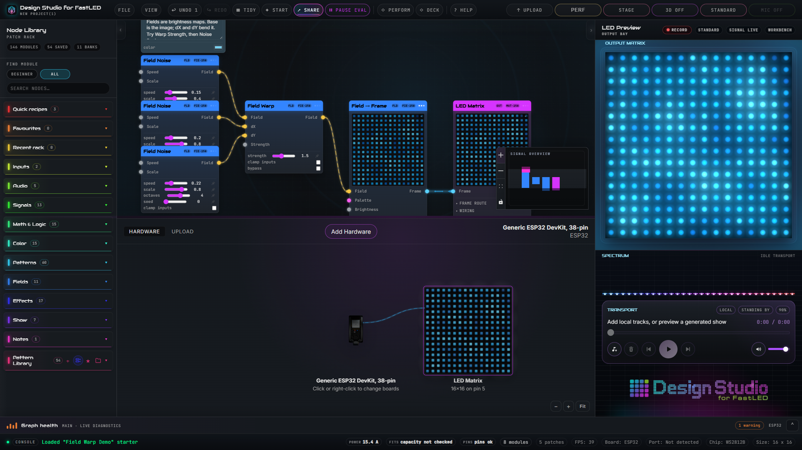
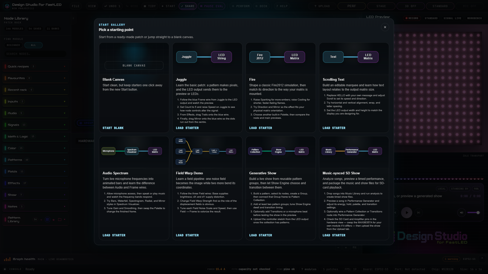
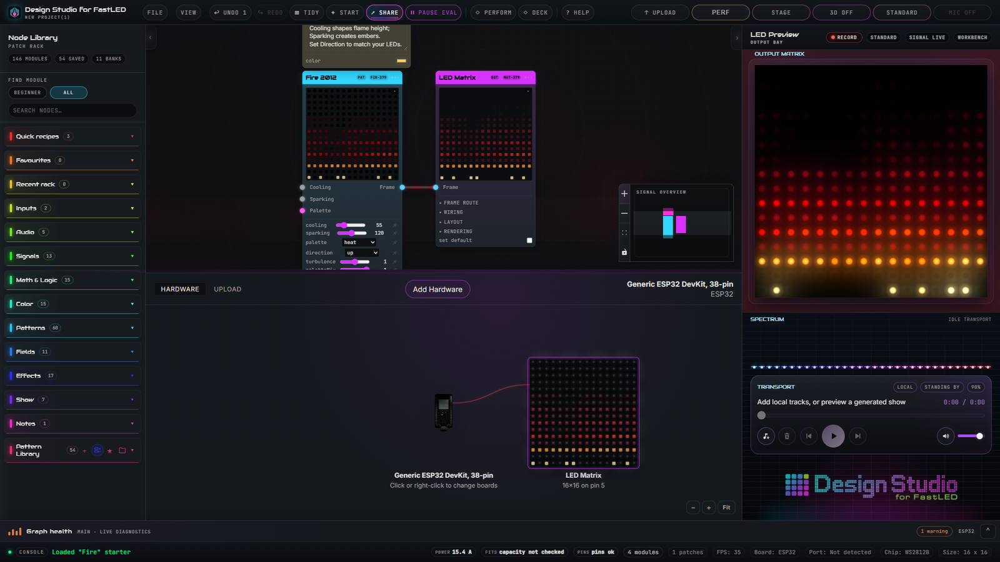
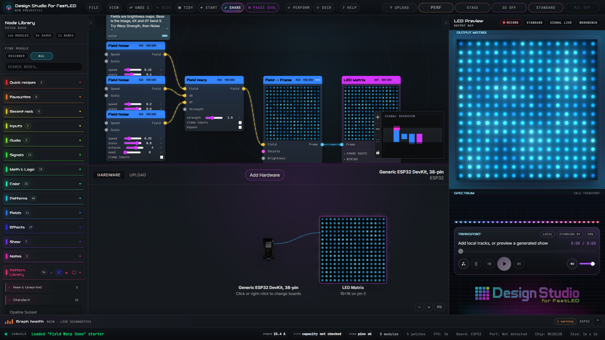
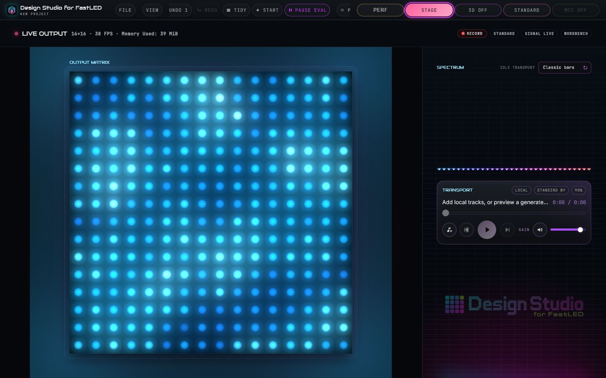

# Design Studio for FastLED

## Build LED worlds visually. Ship them as real FastLED firmware.

Design Studio for FastLED is a live, node-based creative environment for LED strips, matrices, and tiled panels. Connect patterns, palettes, signals, effects, audio analysis, and hardware output; watch the result move instantly; then generate or upload the same design as FastLED C++.

**Public beta · 155 modules · 40 included patterns · Windows, macOS, and Linux packaging · MIT core**

[Check beta releases](https://github.com/stevenmunn312-tech/Design-Studio-for-FastLED/releases) · [Run from source](#run-from-source) · [Help test hardware](#help-test-the-beta)



## From idea to LEDs—without breaking your flow

| Create | See | Perform | Deploy |
| --- | --- | --- | --- |
| Build with typed, color-coded nodes instead of starting from a blank sketch. | Preview the complete matrix and individual nodes while you edit. | Run full-screen visuals, audio-reactive patterns, and generative shows. | Generate C++, flash a controller, or stream live frames over USB. |

What makes the Studio useful:

- **Immediate visual feedback.** Adjust a speed, palette, blend, field, or particle control and see the result now.
- **A deep creative toolbox.** Choose from 155 modules spanning patterns, simulations, color, fields, effects, audio, logic, show control, hardware input, and output.
- **Preview-to-firmware parity.** The graph evaluator and C++ generator are designed together so the hardware result follows what you authored.
- **Reusable creative building blocks.** Turn any patch into a Group, save it to the Pattern Library, organize it into shelves, and reuse it in future shows.
- **A real performance workflow.** Stage Mode, the Performance Deck, music transport, spectrum views, transitions, and beat-driven particles turn patches into playable visuals.
- **Hardware-aware guardrails.** Graph Health, wiring diagnostics, board compatibility checks, power warnings, and measured flash/RAM capacity catch problems before upload.
- **A plan for the physical build.** The Build Diagram turns the graph into wiring: a scale controller with its real pin map, power distribution and fuses, exportable parts and connection lists, and printable assembly sheets.
- **Shareable results.** Record the preview as a PNG, GIF, or WebM clip straight from the workspace.
- **Your work stays portable.** Use named projects, Project Files, Graph JSON, share links, recovery snapshots, and standalone `.ino` exports.

## Start with a spark, not an empty canvas

The Start Gallery includes guided patches for Juggle, Fire, scrolling text, live audio, field warping, generative shows, and music-synced SD playback. Each starter arrives with an editable Comment node explaining what to try next.



The first patch is deliberately simple: a live Juggle pattern flows into LED Output. Change a few controls, splice an effect directly into the wire, and the preview responds immediately.

| Build and preview a patch | Browse and collect reusable patterns |
| --- | --- |
|  |  |

## Put the visuals center stage

Press **Stage** or **F10** to turn the workspace into a clean performance view. The output matrix becomes the focus while spectrum, transport, frame rate, memory, and signal state remain visible. Toggle the 3D presentation, cycle spectrum styles, or press **Esc** to return to the editor.



## Get started

### Portable desktop beta

Check [GitHub Releases](https://github.com/stevenmunn312-tech/Design-Studio-for-FastLED/releases) for an archive for your operating system. Extract it and launch **Design Studio for FastLED** (`Design Studio for FastLED.exe` on Windows).

The portable package is designed to include the Studio, local upload helper, `fbuild`, and `esptool`, so users do not need to install Node.js or Python. Keep the launcher open while using USB upload, local project files, and disk-backed Pattern Library features. See [Desktop distribution](docs/release/desktop-distribution.md) for packaging status and limitations.

> Desktop packages are beta builds and are not yet code-signed or notarized. Only run archives downloaded from this repository’s official release page. See [Security messages](#security-and-privacy) below.

### Run from source

Install [Node.js](https://nodejs.org) LTS, then:

```bash
git clone https://github.com/stevenmunn312-tech/Design-Studio-for-FastLED.git
cd Design-Studio-for-FastLED
npm install
npm run dev
```

Open `http://localhost:5173`. Install [Python 3](https://python.org) as well if you want the local upload helper and hardware features.

You can also use the included launchers:

- **Windows:** double-click `Start Design Studio for FastLED.bat`
- **macOS:** double-click `Start Design Studio for FastLED.command`; on first use, right-click it and choose **Open**
- **Linux:** run `./start.sh`

Without Python, visual authoring, live preview, projects, sharing, and code export still work. Direct hardware actions remain unavailable.

## Your first five minutes

1. Choose **Start with Juggle** or open **✦ Start** and pick a guided patch.
2. Read the graph from left to right. Sources create signals or pixels; effects transform them; **LED Output** is the destination.
3. Change a speed, palette, particle style, or effect amount and watch the preview react.
4. Drag a module from the Node Library—or drag a wire onto empty canvas to see only compatible next nodes.
5. Press **? Help** for shortcuts, upload guidance, illustrated examples, and searchable documentation for every module.

For an even faster experiment, use the sidebar’s **Quick recipes**: *Live spectrum*, *Beat colour jump*, and *Percussion trails* place complete audio-reactive chains on the canvas with a tutorial note.

## Three ways to create

### Design one patch

```text
Pattern → signals / palettes / effects → LED Output → LEDs
```

This is the shortest route from an idea to hardware. Every frame-producing pattern can run alone or flow through a chain of transforms, masks, feedback, fields, and color tools.

### Build a generative show

```text
Pattern → Group → Pattern Library → Pattern Collection
        → Show Engine → LED Output → LEDs
```

Save finished patterns as reusable Groups, collect the ones you want, and let Show Engine choose timing and transitions. Add an optional beat input to advance the show and trigger particle bursts. The preview and generated controller sketch share the same show structure.

### Author a music-synced SD show

```text
Music Library → Performance Generator → SD Card → LED Output
```

Analyze MP3s, generate a timed show, hand-edit its event timeline, audition it against the music, and package the player, show data, and tracks for SD-card playback. A Pattern Collection can provide the visual vocabulary.

> Music-synced SD provisioning is experimental. See the [Beta support matrix](docs/release/beta-support-matrix.md) before planning a production installation.

## From preview to hardware

Configure the controller, size, LED chipset, color order, pins, brightness, physical layout, and optional power cap directly on **LED Output**. Then choose the workflow that fits the moment:

- **Upload** — compile and flash a standalone FastLED sketch.
- **Re-upload last sketch** — resend the current project’s last upload without regenerating it.
- **Flash Wiring Test** — verify color order, brightness, orientation, tiles, and physical pixel order before the graph is finished.
- **Flash Stream Receiver + Live Stream** — flash once, then send live preview frames over USB without recompiling after every edit.
- **View Code / Export `.ino`** — inspect, modify, or build the generated sketch yourself.
- **Upload show to SD** — provision the separate music-synced playback workflow.

Graph Health continuously explains incomplete wiring, pin conflicts, output power, controller compatibility, show structure, and memory pressure. The live controller-capacity meter performs a real compile-only check against the selected board and reports measured flash/RAM use when the toolchain can provide it.

When it is time to build the rig rather than the patch, switch to **View → Build Diagram** for a physical wiring workspace derived from the same graph: the selected controller drawn to scale with its real pin map, power distribution and fuse blocks, a parts list and connection list you can export as CSV, and printable assembly sheets.

## Pattern Library

The Pattern Library turns good experiments into a personal visual vocabulary:

- New saves and imports land in **New & Unsorted**.
- **Standard** and **Audio Reactive** are built-in shelves holding 40 curated patterns, 20 on each.
- **Scan patterns** adds a Studio Score judged against what each pattern is for, alongside your own 1–5 star rating. Sort or filter a collection by either.
- Create your own shelves, drag patterns between them, and remove a shelf without deleting its contents.
- Click or drag a pattern onto the canvas, or drop it directly into a Pattern Collection.
- With the local helper running, personal patterns are mirrored as shareable JSON files in the per-user `My Patterns` data folder.

Built-in patterns are immutable examples. Your own patterns remain yours to rename, organize, share, remix, and delete.

## Feature map

<details>
<summary><strong>Show all 155 modules by category</strong></summary>

- **Inputs:** Microphone, Button, Potentiometer, Encoder, DMX / Art-Net, RTC Clock, MIDI
- **Audio:** FFT Analyzer, Beat Detect, Percussion Detect, Audio Features, Audio → Hue
- **Signals:** Time, Interval, Counter, Random, Envelope, Sin, Cos, Wave, Complex Wave, BeatSin, Clock, Schedule Trigger, DMX Channel
- **Math & Logic:** Math, Clamp, Map Range, Lerp, Ease, Abs, Mod, Gate, Smooth, Sample & Hold, Switch, Not, Compare, Trigger, XY → Index
- **Color:** Hue Cycle, HSV → RGB, RGB → HSV, Color Temperature, Heat Color, Blend Colors, CHSV, Gradient Sampler, Palette Sampler, Palette Sweep, Palette Selector, Custom Palette, Palette from Image, Poline Palette, Blend Palettes
- **Patterns:** Solid Color, Text, Clock Display, Circle, Line, Shape, Path, 3D Wireframe, Gradient Frame, Palette Gradient, Image, Noise, Plasma, Rainbow, Pride 2015, Pacifica, TwinkleFox, Scanner, Confetti, Juggle, Radial Burst, Spiral, Kaleidoscope, Fractal Noise, Gabor Noise, Blobs, Fire, Fire 2012, Particles, Formula Points, Flow Field, Starfield, Boids, Reaction Diffusion, Game of Life, Spectrum Bars, Spectrum Visualizer, Bass Pulse, Bass Rings, Midrange Waves, Midrange Bloom, Treble Sparks, Treble Prism, Audio Cascade, Beat Flash, Kick Shock, Vocal Aurora, Beat Kaleidoscope, Spectra Mosaic, Percussion Blobs, Ember Pulse, Turbulent Bloom, Gravity Well, Rain Ripples, Prism Storm, Audio Flow, Color Trails, AnimARTrix, Custom Formula, Code
- **Fields:** Field Formula, Field Noise, Formula Field, Wave Sim, Distance Field, Frame → Field, Field Math, Field Warp, Field Rotate, Field Tile, Field → Frame
- **Effects:** Blur 2D, Blend, Mask, Brightness, Fade to Black, Hue Shift, Gamma, Saturation, Color Boost, Transform, Array, Invert, Mirror, Trails, Frame Feedback, Frame Switch, Zones
- **Show:** Music Library, Pattern Collection, Transitions, Show Engine, Sequencer, Transition, Performance Generator, SD Card
- **Output:** Amplifier, Board, LED Matrix
- **Notes:** Comment

</details>

<details>
<summary><strong>Advanced and experimental workflows</strong></summary>

- **Audio reactive:** live microphone analysis, FFT bands, beat/percussion features, audio-driven color and pattern nodes, plus on-device INMP441 support for validated ESP32-S3 show configurations.
- **Fields and simulations:** scalar-field math and warping, reaction diffusion, Game of Life, particles, flow fields, boids, feedback, trails, image palettes, and custom formulas.
- **Show control:** reusable pattern collections, 16 transition styles, beat-driven particles, section-aware music shows, timeline editing, and performance controls.
- **Physical layouts:** strips, serpentine matrices, tiled panels, multiple outputs, and custom XY maps. Only the exact combinations recorded in the support matrix count as supported today.
- **DMX / Art-Net:** Art-Net preview plus Art-Net or DMX512 firmware paths. Hardware validation has not yet been recorded, so all modes remain experimental.
- **Clock and schedules:** build-time, manual, NTP-backed, and battery-backed DS3231 clocks; time windows and scheduled triggers; digital/analog clock patterns. Hardware validation is still open for every clock path.

</details>

## Projects, files, and sharing

- **Project** — the everyday named, autosaved workspace.
- **Project File** — a portable full workspace created with **Save Project File As**.
- **Graph JSON** — raw graph interchange.
- **Share Link** — a URL containing the workspace.
- **Recovery Snapshot** — a recent browser-local restore point.
- **Pattern** — a reusable saved Group in the Pattern Library.

Imported projects, patterns, and share links are treated as untrusted, because they can carry code and network settings written by someone else. Until you review the source and choose **Trust and run**, Formula and Code node previews stay blank and no Art-Net listener is opened. Everything else — patterns, effects, fields, audio — runs normally, so most shared patches look complete and open without a prompt: you are only asked when the file actually contains something that is being held back. Export and upload are still allowed but ask first, since generated firmware runs on your board with no sandbox around it.

## Beta hardware scope

This is a public beta with a deliberately narrow support promise. A combination counts as supported only after an end-to-end hardware run is recorded in the repository.

Current recorded combinations include:

| Board and LEDs | Validated paths |
| --- | --- |
| ESP32-S3 · 16×16 WS2812B serpentine matrix · Windows 11 / Chrome · `fbuild` | Normal upload, Flash Wiring Test, sustained Live Stream, generative show, and an INMP441 audio-reactive show |
| ESP8266 · 10×1 WS2812B strip · Windows 11 / Chrome · `arduino-cli` | Normal upload, Flash Wiring Test, and Live Stream |

Everything else—including other boards, browsers, operating-system combinations, chipsets, tiled/custom layouts, PSRAM modes, SD-show provisioning, DMX/Art-Net, and network clock paths—remains experimental until it appears in the [Beta support matrix](docs/release/beta-support-matrix.md).

## Help test the beta

Real hardware reports are the fastest way to expand that support matrix. The LED Output upload panel includes an opt-in **Beta hardware coverage** report that shows exactly what will be copied or downloaded; nothing is submitted automatically.

Useful reports include:

- operating system and Design Studio for FastLED version;
- exact board, LED chipset, dimensions, color order, pins, layout, and power arrangement;
- build engine and the path tested—compile, upload, Wiring Test, Live Stream, microphone, or SD playback;
- whether the preview matched the physical LEDs;
- the generated report plus a focused log tail, photo, or short video.

Read the [Hardware validation guide](docs/release/beta-hardware-validation.md), then open a [GitHub issue](https://github.com/stevenmunn312-tech/Design-Studio-for-FastLED/issues). Never include Wi-Fi credentials, private project data, or unrelated logs.

> LED installations can draw substantial current. Use a correctly rated power supply, fuse and inject power where required, connect grounds correctly, and never power a large LED load through a microcontroller regulator or USB connector.

## Security and privacy

- **Unsigned beta packages:** Windows SmartScreen or macOS Gatekeeper may warn because desktop builds are not yet signed/notarized. Only make a one-time exception for an archive you intentionally downloaded from this repository’s release page; do not disable operating-system protections globally.
- **Microphone:** audio-reactive preview requires browser permission. Denying it simply leaves live audio nodes inactive.
- **Local helper:** USB upload, streaming, native file dialogs, and disk-backed project/pattern sync use a localhost service on your machine.
- **Network credentials:** Art-Net and NTP credentials stay in browser-local storage and are excluded from projects and share links. Generated network-enabled firmware necessarily embeds them in plain text, so treat exported `.ino` files accordingly.
- **Art-Net preview:** the helper opens a local-network UDP listener only while an Art-Net input is active **and** the workspace is trusted. The port to listen on is stored in the graph, so an untrusted project cannot open a socket on your machine before you have looked at it.

Read [SECURITY.md](SECURITY.md) for the full policy and private vulnerability-reporting process.

## Browser and desktop scope

- Designed for desktop at `1440 × 900`; supported minimum `1280 × 720`.
- Modern Chromium, Firefox, and Safari can author and preview; exact tested combinations are listed in the support matrix.
- The installable PWA can reopen core authoring and preview offline after its first successful load.
- Upload, Live Stream, device discovery, native file dialogs, and disk-backed sync require the local helper on the same machine.

## Development

```bash
npm run dev            # local development server
npm run lint           # ESLint
npm test               # Vitest
npm run build          # type-check + production build
npm run preview        # serve the production build
npm run package:desktop
```

See [CONTRIBUTING.md](CONTRIBUTING.md) for bug reports, development conventions, pull requests, and hardware validation.

## Credits and licensing

Design Studio for FastLED’s core is MIT licensed. See [LICENSE](LICENSE), [third-party notices](THIRD_PARTY_NOTICES.md), and the [changelog](CHANGELOG.md).

Offline music analysis uses [Essentia](http://essentia.upf.edu). **Color Trails** is adapted from prototype work by [Stefan Petrick](https://github.com/StefanPetrick), creator of [AnimARTrix](https://github.com/StefanPetrick/animartrix). The separately licensed **AnimARTrix** integration preserves Stefan’s credit and CC BY-NC-SA 4.0 terms in [its license](src/animartrix/LICENSE.md).

Design Studio for FastLED is an independent community project. It generates code for the [FastLED](https://github.com/FastLED/FastLED) library but is not affiliated with, endorsed by, or sponsored by the FastLED project or its maintainers. “FastLED” is used only to describe compatibility with that library.

Release references: [support matrix](docs/release/beta-support-matrix.md) · [supported-platform policy](docs/release/supported-platform-policy.md) · [versioning and releases](docs/release/versioning-and-releases.md) · [desktop distribution](docs/release/desktop-distribution.md)
