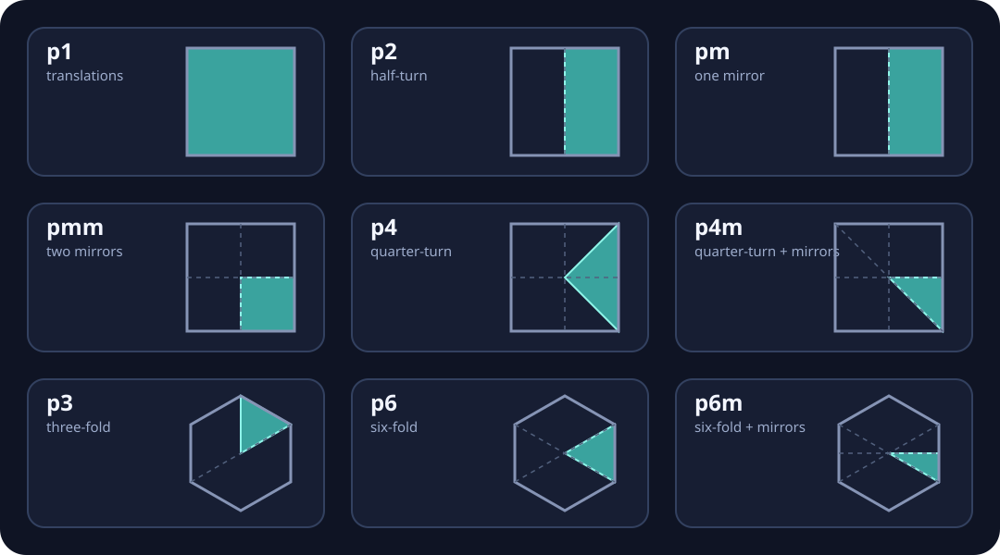

# Wallpaper symmetry groups

Status: implemented · Owner: app · Date: 2026-09-28

## Purpose

`FieldSymmetry` and `Symmetry` repeat source material through a wallpaper
group. The field node keeps hard scalar boundaries with nearest-neighbour
sampling; the frame node uses the shared bilinear sampler, so images and
finished patterns stay smooth while moving.

The first slice is append-only: `p1`, `p2`, `pm`, `pmm`, `p4`, `p4m`, `p3`,
`p6`, and `p6m`. The square groups use the square cell finder. The three- and
six-fold groups use the flat-top hexagonal cell finder, whose centres form the
required triangular translation lattice.

## Node contract

Both nodes expose the same controls:

- `group` chooses the wallpaper group and is baked into firmware.
- `cells` is the number of lattice cells across the canvas width, clamped to
  0.5–8. It is an ordinary, un-normalised numeric input.
- `rotation` and `spin` rotate the lattice in degrees and degrees per second.
- `offsetX` and `offsetY` scroll it in lattice-cell units, clamped to −8–8.

The input frame or field is declared first, preserving the splice-target rule.
Every numeric control is a property input, so an LFO, audio signal, or hardware
control can animate it. With `p1`, one cell, zero rotation and zero offset, both
nodes are exact identities.

## Geometry and sampling

Each output pixel is transformed in this order:

1. Convert the pixel centre to a width-scaled lattice coordinate. Width scales
   both axes, so cells stay regular on a rectangular canvas.
2. Apply `rotation + spin × time`, then the two cell-space offsets.
3. Find the containing square or hexagonal cell.
4. Fold its local coordinate into the selected fundamental domain.
5. Read that coordinate around the centre of the source canvas.

`p2`, `p4`, `p3`, and `p6` reduce the polar angle modulo their rotation.
`p4m` and `p6m` additionally reflect it into half a sector. `pm` reflects one
axis and `pmm` reflects both. The fold is idempotent, and tests apply each
group's generators to prove equivalent points land on the same domain point.

## Preview and firmware ownership

The browser owns one fold in `src/state/evaluator/symmetry.ts`; both evaluators
call its shared source-coordinate resolver. Generated firmware owns the numeric
twin in `src/codegen/symmetryHelperCpp.ts`, emitted once behind
`needsSymmetry`. Its numeric group ids are the append-only TypeScript group
order. The node emitters also reuse the existing lattice helper, and the frame
node reuses the Frame Warp sampler.

The helper writes folded X/Y through primitive float references. It does not
return a custom struct: Arduino's prototype preprocessor otherwise hoists the
function declaration ahead of that struct. The Phase 3 fixture compiles both
nodes on classic ESP32; toolchain, source hash, flash, and RAM are recorded in
the [pattern-node compile checks](../reports/compile/pattern-node-compile-checks.md).
