# Node cards

One reference card per node in the library, generated from `NODE_LIBRARY`
by `scripts/generate-node-card-svgs.ts` (`npm run gen:node-cards`).
Regenerate after adding or changing a node — do not edit the SVGs by hand.

## Inputs

### Microphone

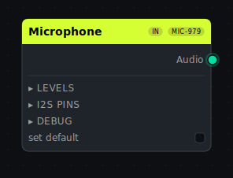

### Button

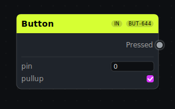

### Potentiometer

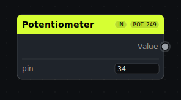

### Encoder

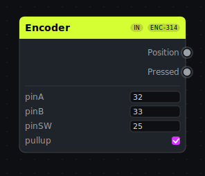

### MIDI

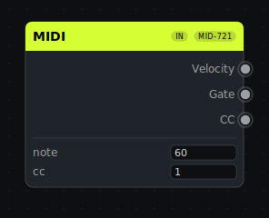

## Audio

### FFT Analyzer

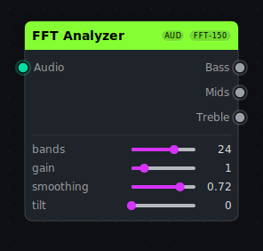

### Beat Detect

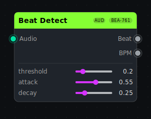

### Percussion Detect

### Audio Features

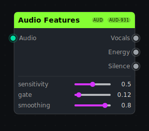

### Audio → Hue

## Signals

### Time

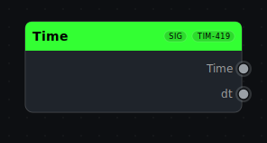

### Interval

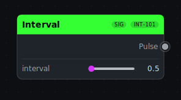

### Counter

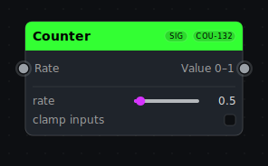

### Random

### Envelope

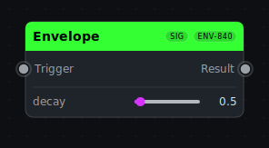

### Sin

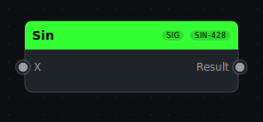

### Cos

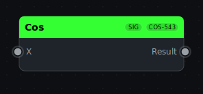

### Wave

### Complex Wave

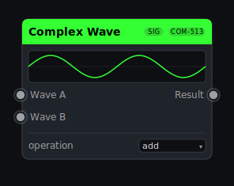

### BeatSin

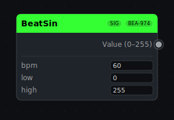

### Clock

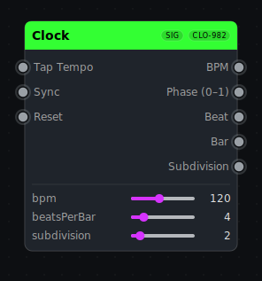

## Math & Logic

### Math

### Clamp

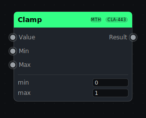

### Map Range

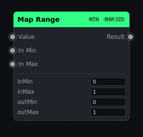

### Lerp

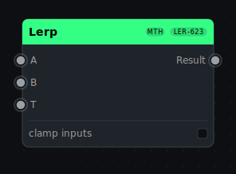

### Ease

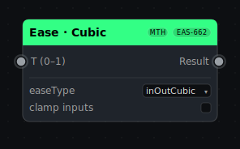

### Abs

### Mod

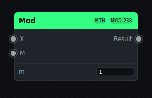

### Gate

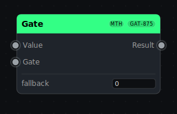

### Smooth

### Sample & Hold

### Switch

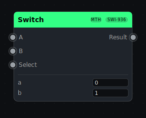

### Not

### Compare

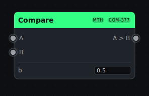

### Trigger

### XY → Index

## Color

### HSV → RGB

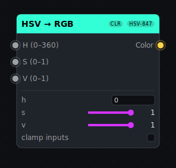

### RGB → HSV

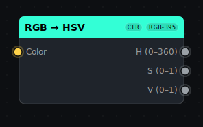

### Color Temperature

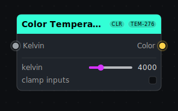

### Heat Color

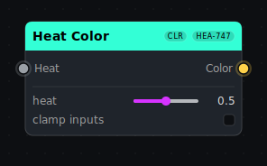

### Blend Colors

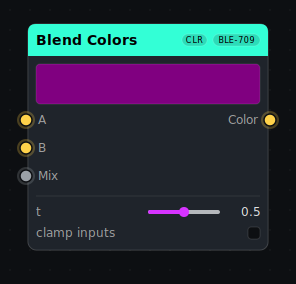

### CHSV

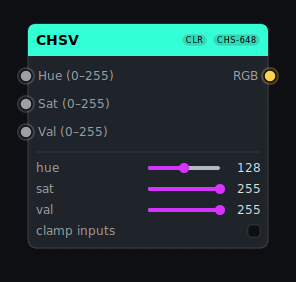

### Gradient Sampler

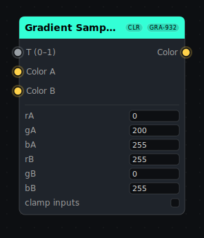

### Palette Sampler

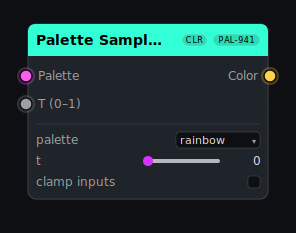

### Palette Selector

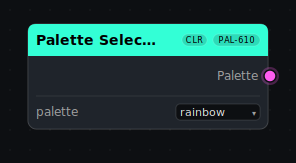

### Custom Palette

### Poline Palette

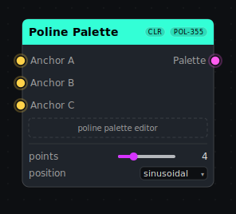

### Blend Palettes

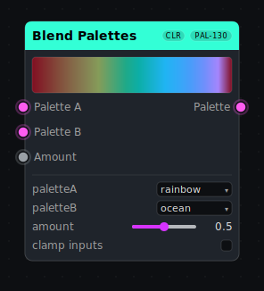

## Patterns

### Solid Color

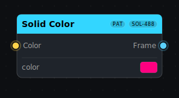

### Text

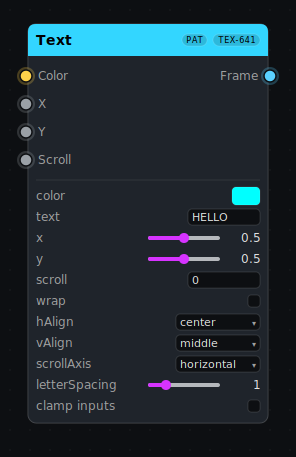

### Circle

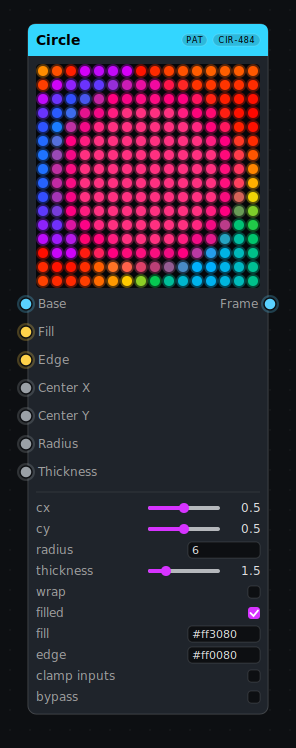

### Line

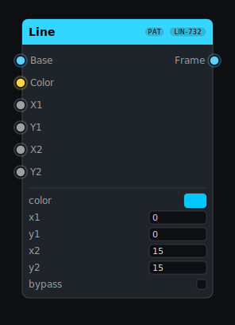

### Shape

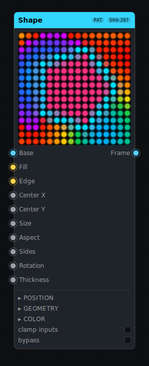

### Path

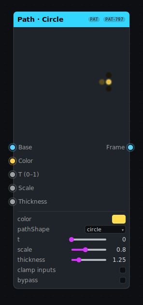

### Gradient Frame

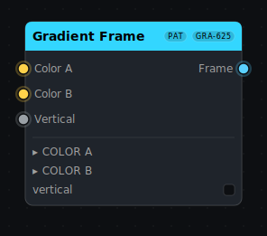

### Palette Gradient

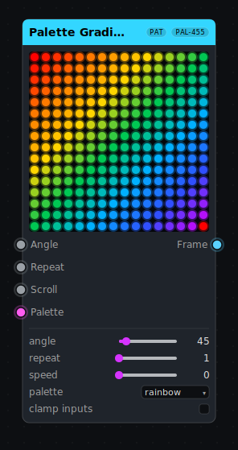

### Image

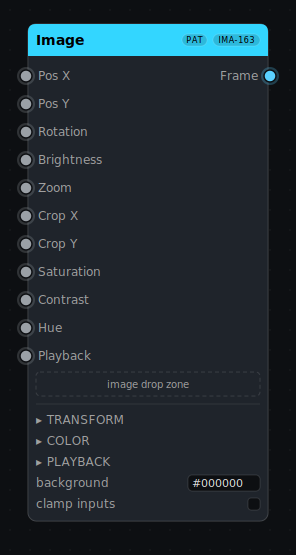

### Noise

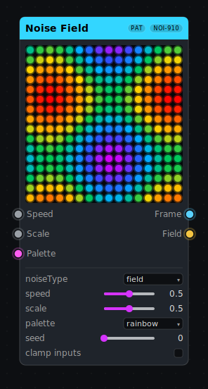

### Plasma

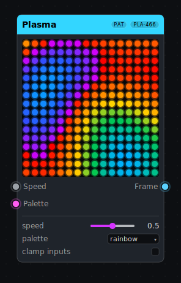

### Rainbow

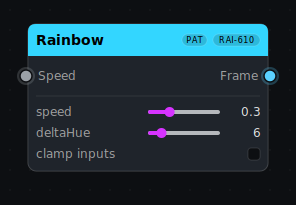

### Pride 2015

### Pacifica

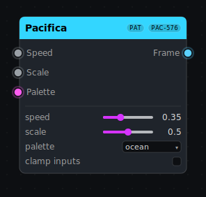

### TwinkleFox

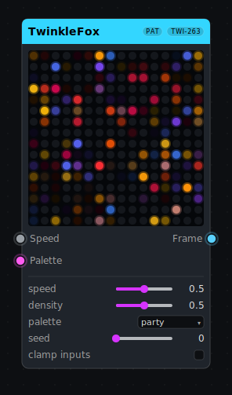

### Scanner

### Confetti

### Juggle

### Radial Burst

### Spiral

### Kaleidoscope

### Fractal Noise

### Gabor Noise

### Blobs

### Fire

### Fire 2012

### Particles

### Flow Field

### Starfield

### Boids

### Reaction Diffusion

### Game of Life

### Spectrum Bars

### Bass Pulse

### Bass Rings

### Midrange Waves

### Midrange Bloom

### Treble Sparks

### Treble Prism

### Audio Cascade

### Beat Flash

### Kick Shock

### Vocal Aurora

### Beat Kaleidoscope

### Spectra Mosaic

### Percussion Blobs

### Ember Pulse

### Turbulent Bloom

### Gravity Well

### Rain Ripples

### Prism Storm

### Audio Flow

### Custom Formula

### Code

## Fields

### Field Formula

### Field Noise

### Wave Sim

### Distance Field

### Frame → Field

### Field Math

### Field Warp

### Field Rotate

### Field Tile

### Field → Frame

## Effects

### Blur 2D

### Blend

### Mask

### Brightness

### Fade to Black

### Hue Shift

### Gamma

### Saturation

### Color Boost

### Transform

### Array

### Invert

### Mirror

### Trails

### Frame Feedback

### Frame Switch

### Zones

## Show

### Music Library

### Pattern Collection

### Transitions

### Show Engine

### Sequencer

### Transition

### Performance Generator

### SD Card

## Output

### Matrix Output

## Notes

### Comment

